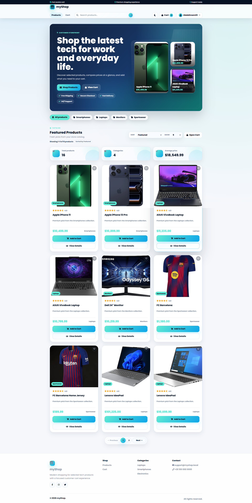
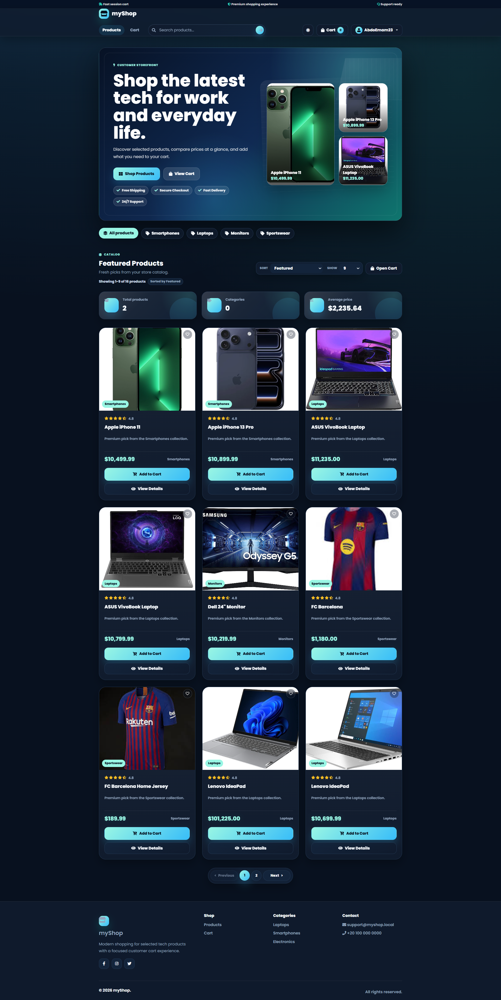
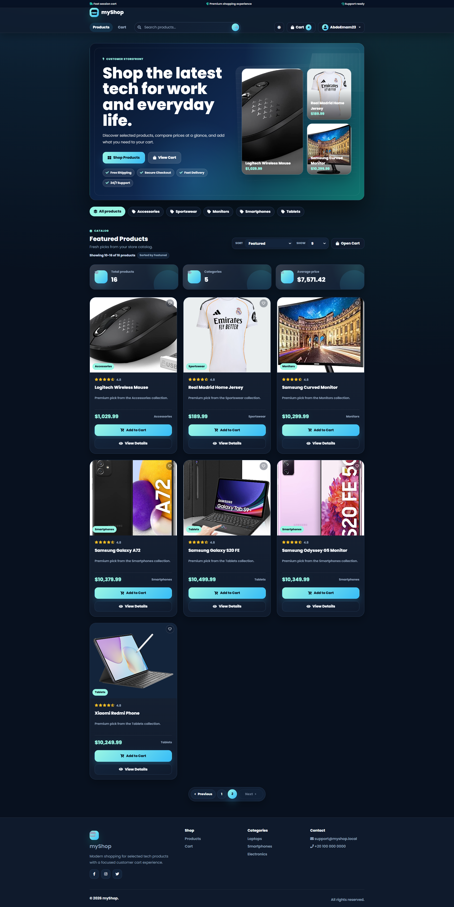
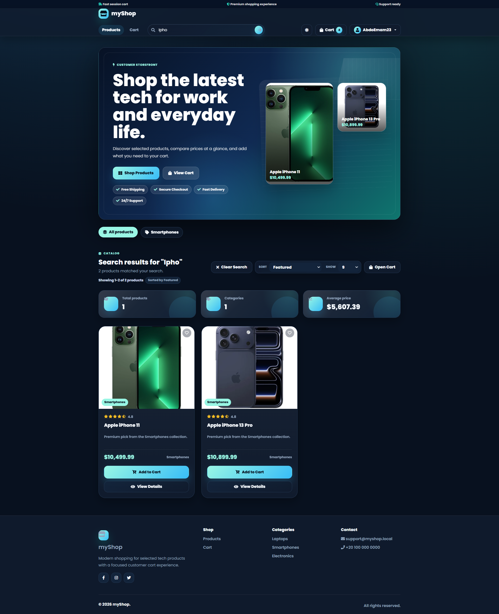
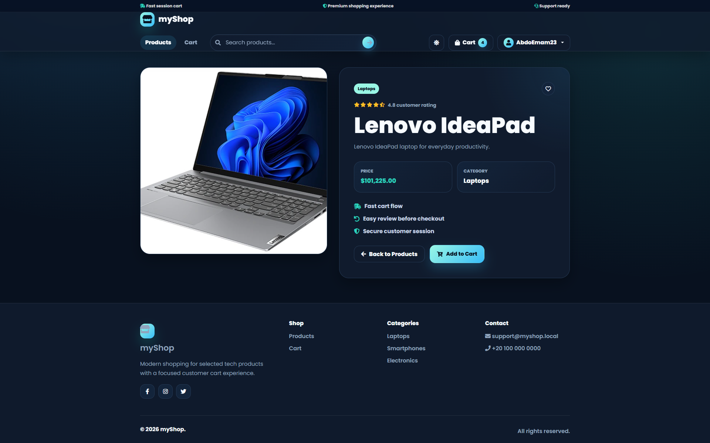
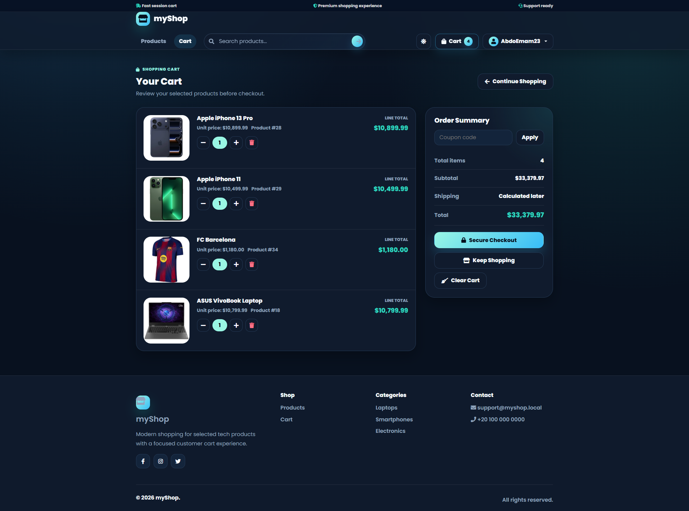

# 🛒 MyShop - E-Commerce Management System

A modern **E-Commerce Management System** built with **ASP.NET Core MVC (.NET 10)** following **N-Tier Architecture**, **Repository Pattern**, **Unit of Work**, and **Specification Pattern**.

The project includes a complete **Admin Dashboard** for managing the store and a modern **Customer Storefront** for browsing products, searching, sorting, and managing a shopping cart.

---

# 🚀 Features

## 🛍 Customer Store

- Modern Responsive Store UI
- Product Catalog
- Product Details
- Shopping Cart
- Product Search
- Product Sorting
- Server-Side Pagination
- Dark & Light Theme
- Session-Based Cart

---

## 📦 Product Management

- Create Product
- Update Product
- Delete Product
- Product Details
- Product Listing
- Product Image Upload
- Category Assignment

---

## 📂 Category Management

- Create Category
- Update Category
- Delete Category
- Category Listing
- Memory Cache (30 Minutes)
- Automatic Cache Invalidation after Create, Update, and Delete

---

## 👥 User Management

- Display Users
- Edit Users
- ASP.NET Core Identity Integration

---

## 🔐 Role Management

- Create Roles
- Display Roles
- Assign Roles to Users
- Edit User Roles

---

## 🔑 Authentication & Authorization

- ASP.NET Core Identity
- Login
- Register
- Forgot Password
- OTP Verification
- Password Reset
- Role-Based Authorization

---

## ⚡ Performance

- Server-Side Pagination
- Specification Pattern
- Dynamic Searching
- Dynamic Sorting
- Memory Cache
- Optimized Database Queries using Skip/Take

---

## 🏗 Architecture

- N-Tier Architecture
- Repository Pattern
- Unit Of Work
- Specification Pattern
- Service Layer
- DTO Pattern
- AutoMapper
- Dependency Injection

---

## 💾 Database

- SQL Server
- Entity Framework Core
- Code First
- EF Core Migrations
- SQL Server Database Backup Included

---

# 🛠 Technologies

- ASP.NET Core MVC (.NET 10)
- Entity Framework Core
- SQL Server
- ASP.NET Core Identity
- AutoMapper
- Bootstrap 5
- AdminLTE
- LINQ
- Memory Cache
- Session
- Repository Pattern
- Unit Of Work

---

# 📂 Project Structure

```
MyShop
│
├── Database
│   └── MyShop.bak
│
├── Images
│
├── MyShop.PL
├── MyShop.BLL
└── MyShop.DAL
```

---

# 🚀 Getting Started

## Prerequisites

- .NET 10 SDK
- SQL Server / SQL Server Express
- Visual Studio 2022

---

## Clone Repository

```bash
git clone https://github.com/AbdelrahmanYehiaGharib23/MyShop.git

cd MyShop
```

---

## Restore NuGet Packages

```bash
dotnet restore
```

---

## Configure Database

### Option 1 (Recommended)

Restore the SQL Server backup located in:

```
Database/MyShop.bak
```

After restoring the database, update the connection string inside:

```
MyShop.PL/appsettings.json
```

---

### Option 2

Create the database using Entity Framework Core Migrations.

```bash
dotnet ef database update
```

---

## Run the Project

```bash
dotnet run
```

or simply run the solution using **Visual Studio**.

---

# 📌 Current Progress

- ✅ Product CRUD
- ✅ Category CRUD
- ✅ User Management
- ✅ Role Management
- ✅ Authentication
- ✅ Authorization
- ✅ Shopping Cart
- ✅ Product Search
- ✅ Product Sorting
- ✅ Server-Side Pagination
- ✅ Category Memory Cache
- ✅ Product Image Upload
- ✅ ASP.NET Core Identity
- ✅ SQL Server Database Backup

---

# 📸 Screenshots

## 🛍 Customer Store

### Customer Home (Light)



---

### Customer Home (Dark)



---

### Customer Home (Dark Variant)



---

### Product Search



---

### Product Details



---

### Shopping Cart



---

## 📦 Products

### Product List


---

### Create Product


---

### Edit Product


---

## 📂 Categories

### Category List


---

### Create Category


---

## 🔐 Roles

### Display Roles


---

### Create Role


---

### Edit User Role

.png)

---

## 👥 Users

### Display Users


---

### Edit Users


---

# 📖 Future Improvements

- Orders Management
- Payment Integration (Stripe)
- Dashboard Analytics
- Email Confirmation
- Wishlist
- Reviews & Ratings
- Coupons & Discounts
- REST API
- JWT Authentication
- Docker Support

---

# ⚠️ Notes

- Built using **ASP.NET Core MVC (.NET 10)**.
- Follows **N-Tier Architecture** with clear separation of concerns.
- Uses **Repository Pattern**, **Unit Of Work**, and **Specification Pattern**.
- Implements **Server-Side Pagination**, **Searching**, and **Sorting**.
- Uses **Memory Cache** to improve category retrieval performance.
- Shopping Cart is implemented using **ASP.NET Core Session**.
- Authentication and Authorization are powered by **ASP.NET Core Identity**.
- A SQL Server backup (`Database/MyShop.bak`) is included for quick project setup.

---

# 👨‍💻 Author

**Abdelrahman Yehia Gharib Emam**

Junior Backend .NET Developer

- GitHub: https://github.com/AbdelrahmanYehiaGharib23
- LinkedIn: https://www.linkedin.com/in/abdelrahman-yehia-gharib-emam-ba88092a9
