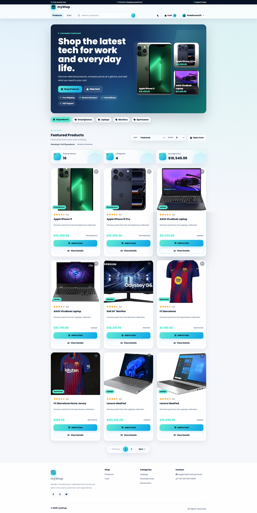
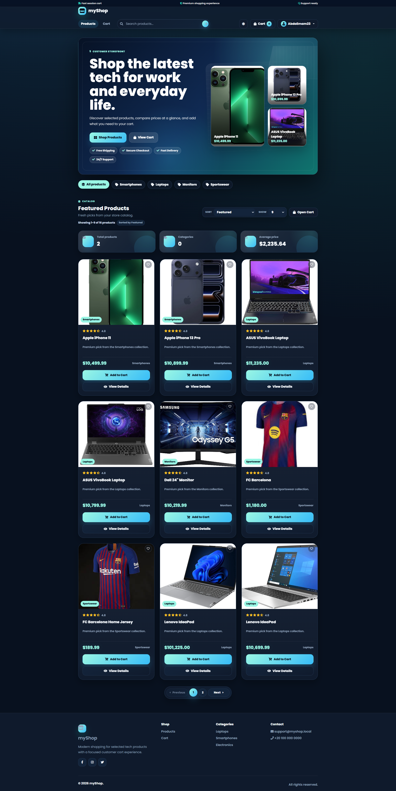
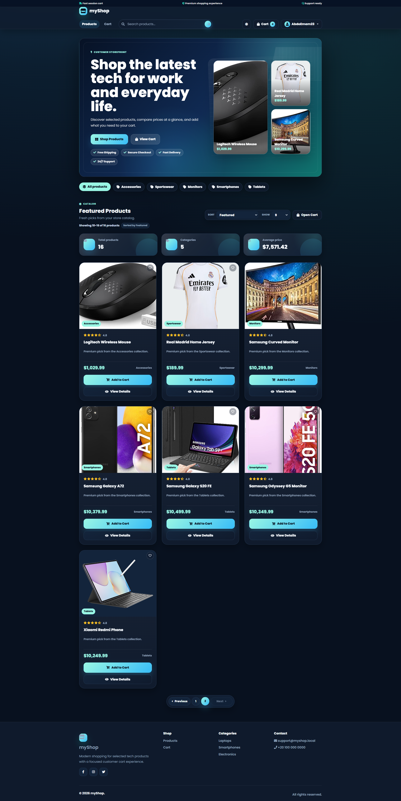
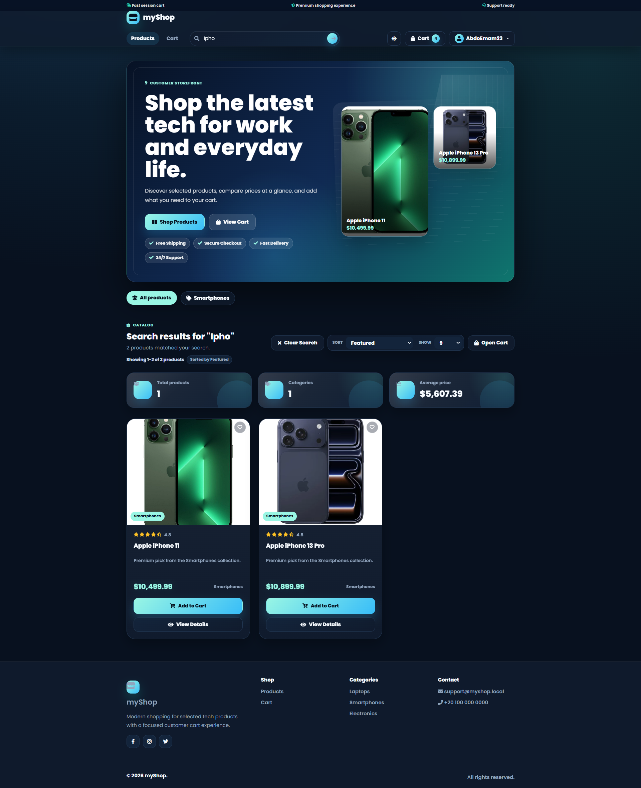
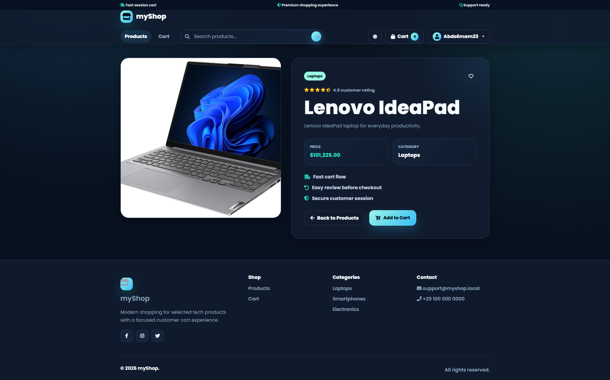
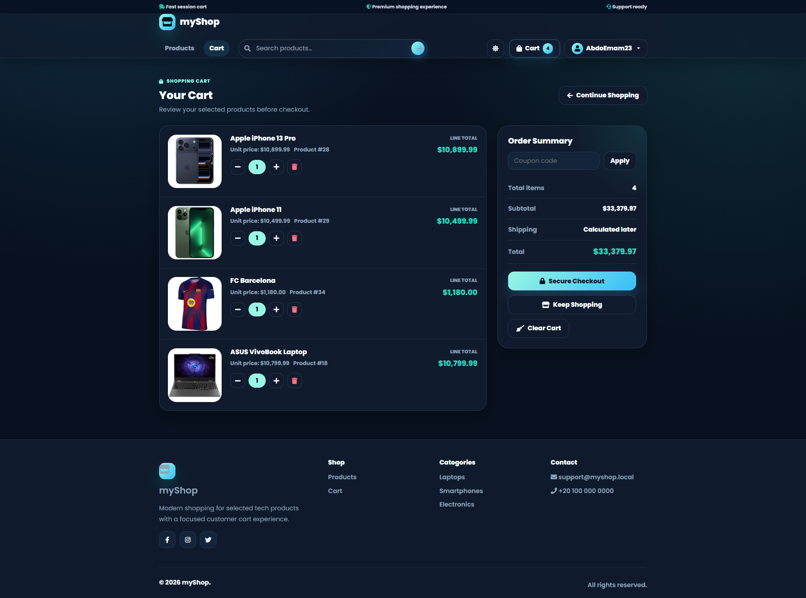
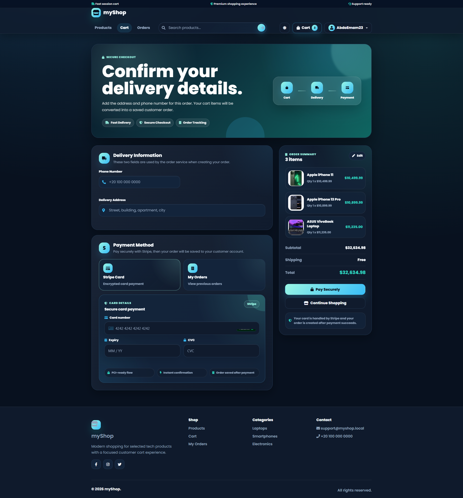

# 🛒 MyShop - E-Commerce Management System

A modern **E-Commerce Management System** built with **ASP.NET Core MVC (.NET 10)** following **N-Tier Architecture**, **Repository Pattern**, **Unit of Work**, and **Specification Pattern**.

The project includes a complete **Admin Dashboard** for managing the store and a modern **Customer Storefront** for browsing products, searching, sorting, managing the shopping cart, placing orders, making payments, and reviewing products.

---

# 🚀 Features

## 🛍 Customer Store

* Modern Responsive Store UI
* Product Catalog
* Product Details
* Shopping Cart
* Product Search
* Product Sorting
* Server-Side Pagination
* Dark & Light Theme
* Session-Based Cart

---

## 📦 Product Management

* Create Product
* Update Product
* Delete Product
* Product Details
* Product Listing
* Product Image Upload
* Category Assignment

---

## 📂 Category Management

* Create Category
* Update Category
* Delete Category
* Category Listing
* Memory Cache (30 Minutes)
* Automatic Cache Invalidation after Create, Update, and Delete

---

## 🛒 Orders & Checkout

* Order Creation
* Checkout Process
* Order Summary
* Order Items Management
* Order Confirmation
* Customer Order Workflow

---

## 💳 Payment

* Stripe Payment Integration
* Secure Checkout Payment Flow
* Payment Processing through Stripe
* Payment Status Handling
* Integration with Order Checkout

---

## ⭐ Product Reviews

* Add Product Reviews
* Display Product Reviews
* Customer Ratings
* Review Management
* Product Rating Integration

---

## 👥 User Management

* Display Users
* Edit Users
* ASP.NET Core Identity Integration

---

## 🔐 Role Management

* Create Roles
* Display Roles
* Assign Roles to Users
* Edit User Roles

---

## 🔑 Authentication & Authorization

* ASP.NET Core Identity
* Login
* Register
* Forgot Password
* OTP Verification
* Password Reset
* Role-Based Authorization

---

## 📧 Email Integration

* Order Confirmation Emails
* Email Templates
* Order Notification Workflow

---

## ⚡ Performance

* Server-Side Pagination
* Specification Pattern
* Dynamic Searching
* Dynamic Sorting
* Memory Cache
* Optimized Database Queries using Skip/Take

---

## 🏗 Architecture

* N-Tier Architecture
* Repository Pattern
* Unit Of Work
* Specification Pattern
* Service Layer
* DTO Pattern
* AutoMapper
* Dependency Injection

---

## 💾 Database

* SQL Server
* Entity Framework Core
* Code First
* EF Core Migrations
* SQL Server Database Backup Included

---

# 🛠 Technologies

* ASP.NET Core MVC (.NET 10)
* Entity Framework Core
* SQL Server
* ASP.NET Core Identity
* AutoMapper
* Bootstrap 5
* AdminLTE
* LINQ
* Memory Cache
* Session
* Stripe
* Repository Pattern
* Unit Of Work
* Specification Pattern

---

# 📂 Project Structure

```text
MyShop
│
├── Database
│   └── MyShop.bak
│
├── Images
│
├── MyShop.PL
├── MyShop.BLL
└── MyShop.DAL
```

---

# 🚀 Getting Started

## Prerequisites

* .NET 10 SDK
* SQL Server / SQL Server Express
* Visual Studio 2022

---

## Clone Repository

```bash
git clone https://github.com/AbdelrahmanYehiaGharib23/MyShop.git

cd MyShop
```

---

## Restore NuGet Packages

```bash
dotnet restore
```

---

## Configure Database

### Option 1 — Recommended

Restore the SQL Server backup located in:

```text
Database/MyShop.bak
```

After restoring the database, update the connection string inside:

```text
MyShop.PL/appsettings.json
```

---

### Option 2

Create the database using Entity Framework Core Migrations:

```bash
dotnet ef database update
```

---

## Configure Stripe

Add your Stripe configuration to:

```text
MyShop.PL/appsettings.json
```

Example:

```json
{
  "Stripe": {
    "PublishableKey": "your_publishable_key",
    "SecretKey": "your_secret_key"
  }
}
```

> ⚠️ Do not commit your real Stripe Secret Key to GitHub. Use **User Secrets** or environment variables for production environments.

---

## Run the Project

```bash
dotnet run
```

or simply run the solution using **Visual Studio**.

---

## Run Tests

Run the unit and HTTP integration test suites from the repository root:

```bash
dotnet test MyShop..sln
```

To generate a Cobertura coverage report:

```bash
dotnet test MyShop..sln --coverlet --coverlet-output-format cobertura
```

See [`tests/README.md`](tests/README.md) for the test layout and contribution guidance. GitHub Actions runs the same test suite on pushes and pull requests.

---

# 📌 Current Progress

* ✅ Product CRUD
* ✅ Category CRUD
* ✅ User Management
* ✅ Role Management
* ✅ Authentication
* ✅ Authorization
* ✅ Shopping Cart
* ✅ Product Search
* ✅ Product Sorting
* ✅ Server-Side Pagination
* ✅ Category Memory Cache
* ✅ Product Image Upload
* ✅ ASP.NET Core Identity
* ✅ Orders
* ✅ Checkout
* ✅ Stripe Payment Integration
* ✅ Order Confirmation Email
* ✅ Product Reviews & Ratings
* ✅ SQL Server Database Backup

---

# 📸 Screenshots

## 🛍 Customer Store

### Customer Home (Light)



---

### Customer Home (Dark)



---

### Customer Home (Dark Variant)



---

### Product Search



---

### Product Details



---

### Shopping Cart



---

### Checkout



---

### Product Reviews


---

## 📦 Products

### Product List


---

### Create Product


---

### Edit Product


---

## 📂 Categories

### Category List


---

### Create Category


---

## 🔐 Roles

### Display Roles


---

### Create Role


---

### Edit User Role

.png)

---

## 👥 Users

### Display Users


---

## Storefront release setup

* Checkout now refreshes cart prices from the product records and asks the customer to review the total when prices change. It snapshots current product data into the order and uses a unique checkout request key to prevent duplicate orders. Apply the `AddCheckoutRequestId` Entity Framework migration before deploying this version.
* Payment status pages read the order state from the server. Paymob’s browser return is informational; the order becomes paid only after the HMAC-validated webhook confirms the amount, currency, and integration. Configure `Paymob:SecretKey`, `Paymob:PublicKey`, `Paymob:IntegrationId`, `Paymob:HmacSecret`, and `Paymob:CallbackBaseUrl` with the provider’s live values and a public HTTPS URL.
* A declined Stripe payment attempt leaves the order pending so the customer can retry. Paymob returns to a status page that refreshes the server state and offers a way back to payment while the order is pending.
* Product records do not currently contain stock quantity, reservation, or shipping rules. The storefront does not claim a stock level or add an unconfigured shipping charge. Add the store’s actual inventory and delivery policies before showing availability or final delivery charges.
* Store events are pushed to `window.dataLayer` using standard event names (`view_item_list`, `view_item`, `search`, `add_to_cart`, `begin_checkout`, `select_payment_method`, and `purchase`). To connect Google Tag Manager, set `Analytics:GoogleTagManagerId` to the store’s `GTM-...` container ID. No external analytics script loads while that setting is empty; choose and implement the required consent behavior before enabling the container.
* The public storefront includes offline feedback, focus-visible states, reduced-motion support, image dimensions, and mobile layouts. Verify the deployed checkout with the live payment accounts and test the storefront on current iOS Safari and Android Chrome before launch.

# 📖 Future Improvements

* Dashboard Analytics
* Inventory management and stock reservation
* Coupons & Discounts
* REST API
* JWT Authentication
* Docker Support

---

# ⚠️ Notes

* Built using **ASP.NET Core MVC (.NET 10)**.
* Follows **N-Tier Architecture** with clear separation of concerns.
* Uses **Repository Pattern**, **Unit Of Work**, and **Specification Pattern**.
* Implements **Server-Side Pagination**, **Searching**, and **Sorting**.
* Uses **Memory Cache** to improve category retrieval performance.
* Shopping Cart is implemented using **ASP.NET Core Session**.
* Authentication and Authorization are powered by **ASP.NET Core Identity**.
* Orders and Checkout are integrated into the customer purchasing workflow.
* Payments are processed through **Stripe**.
* Product Reviews and Ratings are supported for products.
* Order confirmation emails are sent through the email integration.
* A SQL Server backup (`Database/MyShop.bak`) is included for quick project setup.

---

# 👨‍💻 Author

**Abdelrahman Yehia Gharib Emam**

Junior Backend .NET Developer

* GitHub: https://github.com/AbdelrahmanYehiaGharib23
* LinkedIn: https://www.linkedin.com/in/abdelrahman-yehia-gharib-emam-ba88092a9
